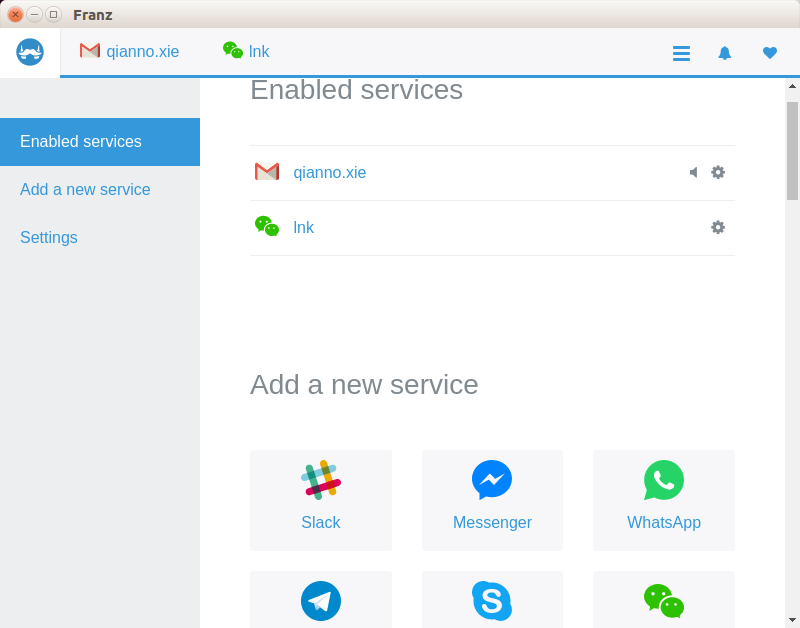

# Introduction
    lnxenv if a note record how to init a linux system.

# Ubuntu
## Version
    16.04
### nopassword sudo
run sudo without password, to do as followed:
```
sudo vi /etc/sudoers
```
and add the following line at last line:
```
yourusername ALL=(ALL) NOPASSWD:ALL
```
and save it with `wq!`.

if you receive the err info:
```
sudo: parse error in /etc/sudoers near line 24
sudo: no valid sudoers sources found, quitting
sudo: unable to initialize policy plugin
```

run command to edit sudoers file:
```
pkexec visudo
```
### zsh
Prereq:
```
apt-get install zsh
apt-get install git-core
```
Getting zsh to work in ubuntu is weird, since sh does not understand the source command. So, you do this to install zsh
```
wget https://github.com/robbyrussell/oh-my-zsh/raw/master/tools/install.sh -O - | zsh
```
and then you change your shell to zsh
```
chsh -s `which zsh`
```
and then restart
```
sudo shutdown -r 0
```
### pbcopy
install xclip
```
sudo apt-get install xclip -y
```
add followed lines to ~/.zshrc
```
alias pbcopy='xclip -selection clipboard'
alias pbpaste='xclip -selection clipboard -o'
```
then refresh your zsh to import your new settings
```
source ~/.zshrc
```

### set launcher bottom
if you want to set launcher to bottom, run command:
```
gsettings set com.canonical.Unity.Launcher launcher-position Bottom
```
and set to left:
```
gsettings set com.canonical.Unity.Launcher launcher-position Left
```
### franz
download it [here](http://meetfranz.com/)
and install it.
### email and wechat
run them at franz



### youdao dict
it need package gstreamer0.10-plugins-ugly but at ubuntu 16.04 it is gstreamer1.0-plugins-ugly.

To Install as followed:
1. download [youdao-dict_1.1.0-0-ubuntu_amd64.deb](http://codown.youdao.com/cidian/linux/youdao-dict_1.1.0-0-ubuntu_amd64.deb)

2. create a dir and extract it. run command:
```
mkdir youdao-dict
dpkg -X ./youdao-dict_1.1.0-0-ubuntu_amd64.deb  youdao-dict
```
3. extract the control information of deb:
```
dpkg -e ./youdao-dict_1.1.0-0-ubuntu_amd64.deb youdao-dict/DEBIAN
```
4. edit control file, and delete Depends gstreamer0.10-plugins-ugly。

5. repackage it：
```
dpkg-deb -b youdao youdaobuild.deb
```
6. Install
```
dpkg -i youdaobuild.deb
```

Oh no, This is too much trouble. as I know, you can download the deepin version [here](http://codown.youdao.com/cidian/linux/youdao-dict_1.1.0-0-deepin_amd64.deb) and install it by `dpkg -i`.
